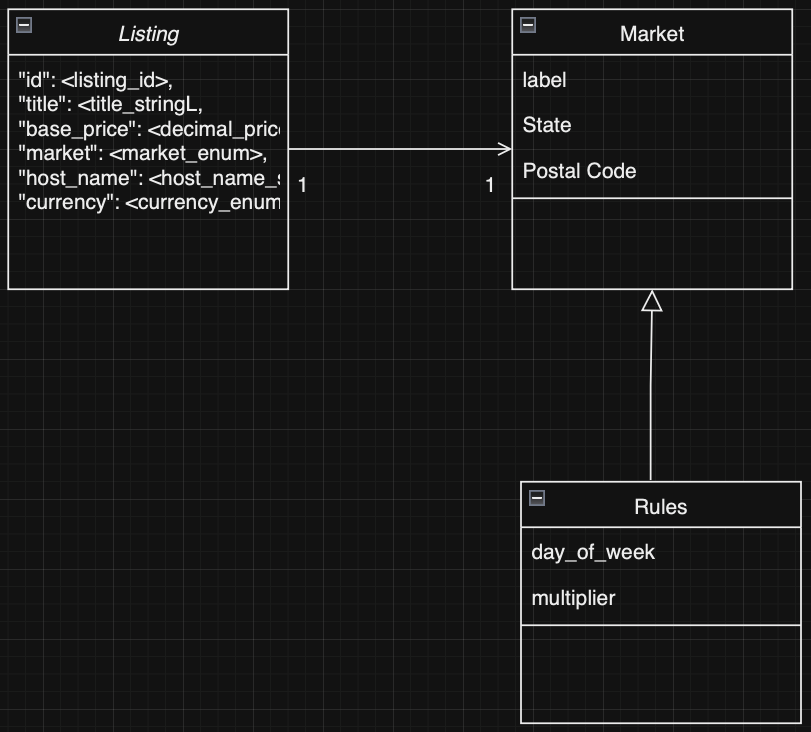
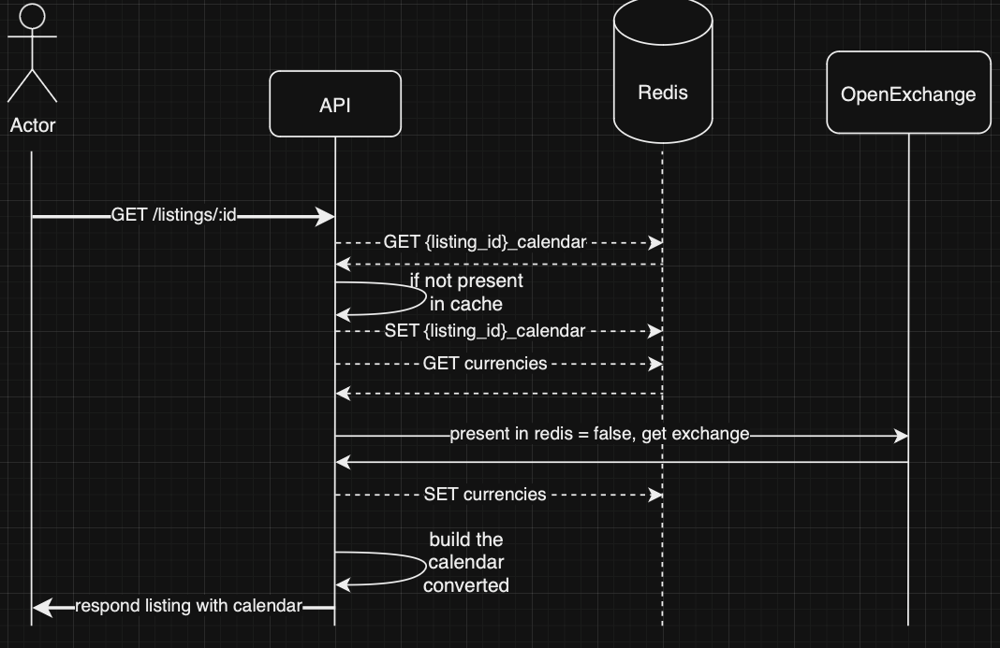
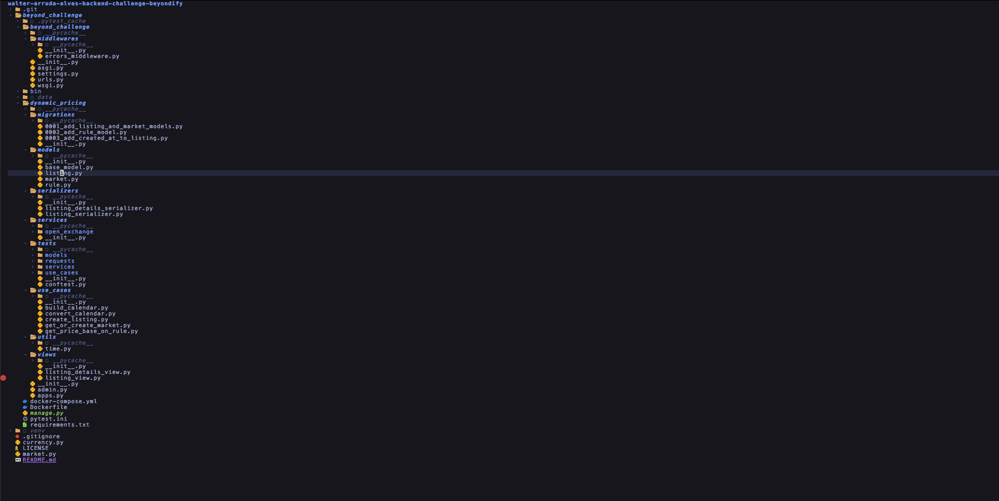
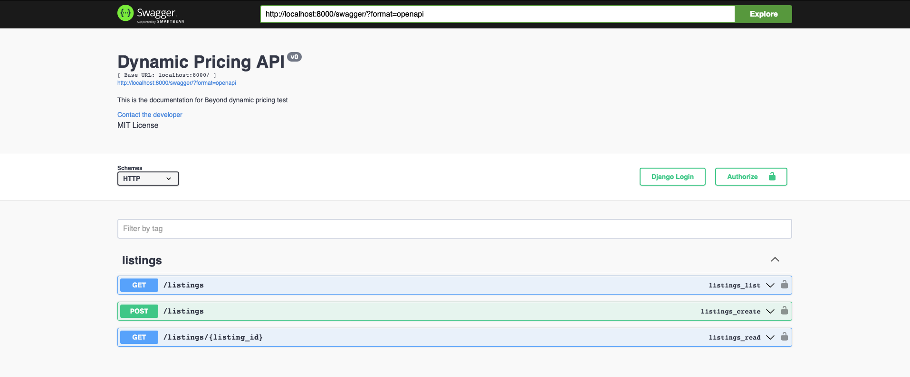

<h1> Dynamic pricing beyond Challenge</h1>
This project is the Technical challenge build from scratch by Walter Alves for Senior Backend Software Engineer role. I've started this project last Saturday(August 10th) splittling my development time due to a few other duties. I hope you enjoy that project!! 🙏🏻   

> The initial content of the README can be find in [this link](initial_README.md)

<h2>Project decisions</h2>

I've decided to use **Django** as framework since is one of the frameworks I've been working in the last two and half years. Also, I decided to use **PostgreSQL** and **Redis** for the same reason. Also, I implemented the project by using **Docker** and **docker compose** to make it easy to setup the project (also for me and to whom will be evaluating this), so to make your life easy, please use docker! 😆

<h2> Project Architecture</h2>

I've strucuted the project in a way that it can be more performatic and also extensible, in that way, I've splitted the models in the structure you can see below:



Also, the "macro execution" can be ilustrated in the following sequence-diagram:



As you can see, the main idea is to build a calender by using the listing base price and also the currency, caching this in redis to avoid unecessary re-calculations and also hits in the exchange endpoints.

> Disclaimer: Since I am using the free-tier OpenExchange plan, the rates are update every 1 hour, then I did added a 30min cache TTL.

<h2> Django project structure</h2>

Below you can find an image containing the project structure and topics with a breaf explanation about the modules in the project.



- `beyond_challenge/`: folder containing the project settings and a error handler middleware;
- `dynamic_pricing/`: Folder containing the app itself, which has all the implementation structure and code; 
	- `management/`: Basic commands;
	- `models/`: Module containing all models presented in the project architecture section;
	- `migrations/`: All Model and Data migrations created;
	- `serializers/`: Module Serializers used by the Views to serialize and deserialize data;
	- `services/`: 3rd party integrations folder, containing any services used to outcoming integrations(e.g.: open exchange);
	- `use_cases/`: Module containing the main business logic;
	- `utils/`: Module containing the utility files;
	- `views/`: Module containing the API views(a.k.a: Controllers & actions);
	- `tests/`: Module containing all tests of the app;
		- `models/`: All models tests;
		- `requests/`: All requests(integration) tests;
		- `services/`: All services tests;
		- `use_cases/`: All use_case tests;
		- `utils/`: All utils tests;

<h2>Running the project</h2>

As I said in the beginning of this document, for running this project we going need to have `docker` and `docker compose` installed in your machine. You can, for sure run this on your host without needing docker, but it will demand you to install `postgresql`, `redis` and also installing a bunch of python libs by running the `pip3 install -r requirememnts.txt` inside the `beyond_challenge` folder, plus having a few ENV vars setup in your machine, then, to make your(and mine) life easier, I did provide a `Dockerfile` and also a `docker-compose` file having the basic structure and configuration setup needed to run this project smoothly. Then, let's get started!

First, let's build and run the whole project(and its required containers):

```
$ docker compose up -d --build
[+] Running 24/24
 ✔ db Pulled                                                                                                                                                                                                    
   ✔ 262a5f25eec7 Pull complete                                                                                                                                                                                 
   ✔ 410e6664cff3 Pull complete                                                                                                                                                                                 
   ✔ 348078e7844f Pull complete                                                                                                                                                                                 
   ✔ e4bb45ed9da0 Pull complete                                                                                                                                                                                 
   ✔ 00ce427aba9b Pull complete                                                                                                                                                                                 
   ✔ 9c0b03073a01 Pull complete                                                                                                                                                                                 
   ✔ c43ccc6a8923 Pull complete                                                                                                                                                                                 
   ✔ aa01237db67e Pull complete                                                                                                                                                                                 
   ✔ 74b92283dde4 Pull complete                                                                                                                                                                                 
   ✔ 4be4a35f7b70 Pull complete                                                                                                                                                                                 
   ✔ 7f69db13ff23 Pull complete                                                                                                                                                                                 
   ✔ 1960e56810f7 Pull complete                                                                                                                                                                                 
   ✔ cca33794197e Pull complete                                                                                                                                                                                 
   ✔ e7b4e1cfe501 Pull complete                                                                                                                                                                                 
 ✔ cache Pulled                                                                                                                                                                                                 
   ✔ 690e87867337 Pull complete                                                                                                                                                                                 
   ✔ c8e7080b1466 Pull complete                                                                                                                                                                                 
   ✔ 28ae03b11f2f Pull complete                                                                                                                                                                                 
   ✔ 28f10c770229 Pull complete                                                                                                                                                                                
   ✔ ee95b24061d4 Pull complete                                                                                                                                                                                 
   ✔ 594c1879b871 Pull complete                                                                                                                                                                                 
   ✔ 4f4fb700ef54 Pull complete                                                                                                                                                                                 
   ✔ 41eaa5a9296d Pull complete                                                                                                                                                                                 
[+] Building 12.5s (10/10) FINISHED                                                                                                                                                             docker:desktop-linux
 => [api internal] load build definition from Dockerfile                                                                                                                                                        
 => => transferring dockerfile: 176B                                                                                                                                                                            
 => [api internal] load metadata for docker.io/library/python:3                                                                                                                                                 
 => [api auth] library/python:pull token for registry-1.docker.io                                                                                                                                               
 => [api internal] load .dockerignore                                                                                                                                                                           
 => => transferring context: 2B                                                                                                                                                                                 
 => [api 1/4] FROM docker.io/library/python:3@sha256:c7862834f921957523cc4dab6d7795a7a0d19f1cd156c1ecd3a3a08c1108c9a4                                                                                           
 => [api internal] load build context                                                                                                                                                                           
 => => transferring context: 48.97MB                                                                                                                                                                            
 => CACHED [api 2/4] WORKDIR /beyond_challenge                                                                                                                                                                  
 => [api 3/4] COPY . /beyond_challenge/                                                                                                                                                                         
 => [api 4/4] RUN pip install -r requirements.txt                                                                                                                                                              
 => [api] exporting to image                                                                                                                                                                                    
 => => exporting layers                                                                                                                                                                                         
 => => writing image sha256:b98387cb09a5113fb8e787656dca853a74ca8700ff388f6dca3f03d969bc071e                                                                                                                    
 => => naming to docker.io/library/beyond_challenge-api                                                                                                                                                         
[+] Running 4/4                                                                                                                                                                                                      
 ✔ Network beyond_challenge_default    Created                                                                                                                                                                  
 ✔ Container beyond_challenge-db-1     Started                                                                                                                                                                  
 ✔ Container beyond_challenge-cache-1  Started                                                                                                                                                                  
 ✔ Container beyond_challenge-api-1    Started   

```

Then, as you can see by running the following command, you will be able to see all the containers are up and running:

```
$ docker compose ps
NAME                       IMAGE                  COMMAND                  SERVICE   CREATED         STATUS         PORTS
beyond_challenge-api-1     beyond_challenge-api   "./bin/wait-for-it.s…"   api       3 minutes ago   Up 3 minutes   0.0.0.0:8000->8000/tcp
beyond_challenge-cache-1   redis:alpine           "docker-entrypoint.s…"   cache     3 minutes ago   Up 3 minutes   6379/tcp, 0.0.0.0:6379->8379/tcp
beyond_challenge-db-1      postgres               "docker-entrypoint.s…"   db        3 minutes ago   Up 3 minutes   5432/tcp
```

But you still are not able to use the project because you need to run the migrations:

```
$ docker compose exec api python manage.py migrate
Operations to perform:
  Apply all migrations: admin, auth, contenttypes, dynamic_pricing, sessions
Running migrations:
  Applying contenttypes.0001_initial... OK
  Applying auth.0001_initial... OK
  Applying admin.0001_initial... OK
  Applying admin.0002_logentry_remove_auto_add... OK
  Applying admin.0003_logentry_add_action_flag_choices... OK
  Applying contenttypes.0002_remove_content_type_name... OK
  Applying auth.0002_alter_permission_name_max_length... OK
  Applying auth.0003_alter_user_email_max_length... OK
  Applying auth.0004_alter_user_username_opts... OK
  Applying auth.0005_alter_user_last_login_null... OK
  Applying auth.0006_require_contenttypes_0002... OK
  Applying auth.0007_alter_validators_add_error_messages... OK
  Applying auth.0008_alter_user_username_max_length... OK
  Applying auth.0009_alter_user_last_name_max_length... OK
  Applying auth.0010_alter_group_name_max_length... OK
  Applying auth.0011_update_proxy_permissions... OK
  Applying auth.0012_alter_user_first_name_max_length... OK
  Applying dynamic_pricing.0001_add_listing_and_market_models... OK
  Applying dynamic_pricing.0002_add_rule_model... OK
  Applying dynamic_pricing.0003_add_created_at_to_listing... OK
  Applying dynamic_pricing.0004_data_migration_add_default_rules... OK
  Applying sessions.0001_initial... OK
```

Then, now you are able to use the API and also see the Swagger(by accessing http://localhost:8000/swagger) and redocs(by accessing http://localhost:8000/redoc/) in your local browser:




Now you are also able to use the API through any request client(e.g.: `curl`, Postman, etc...)

```
$ curl --silent --location --request GET 'http://localhost:8000/listings' | jq

[]
```

> Disclaimer: the `jq` command is a lib used to formmat JSON outputs, it is not mandatory, is used only to prettyfy the outputs, feel free to install(`brew install jq` for mac users) or just remove the pipe (`| jq`) from the end of the command.

Let's create a new Listing to play around with the API!!!

```
$ curl --silent --location --request POST 'http://localhost:8000/listings' \
            --header 'Content-Type: application/json' \
            --data-raw '{
        "title": "Comfortable Room In Cozy Neighborhood",
        "base_price": 500,
        "market": "lisbon",
        "host_name": "Walter Alves",
        "currency": "EUR"
    }' | jq

{
  "id": "a5dd9ab1-b4af-4635-954b-b25683877a11",
  "title": "Comfortable Room In Cozy Neighborhood",
  "market": "lisbon",
  "base_price": "500.00",
  "currency": "EUR",
  "host_name": "Walter Alves"
}
```

Now, we are able to see this in the LIST endpoint as a JSON list:
```
curl --silent --location --request GET 'http://localhost:8000/listings' | jq

[
  {
    "id": "a5dd9ab1-b4af-4635-954b-b25683877a11",
    "title": "Comfortable Room In Cozy Neighborhood",
    "market": "lisbon",
    "base_price": "500.00",
    "currency": "EUR",
    "host_name": "Walter Alves"
  }
]
```

Let's create a few of them, then we can check the listing pagination:

As you can see here, I do create 12 Listings with many different markets:

```
$ docker compose exec api python manage.py shell
Python 3.12.5 (main, Aug  7 2024, 20:49:19) [GCC 12.2.0]
Type 'copyright', 'credits' or 'license' for more information
IPython 8.26.0 -- An enhanced Interactive Python. Type '?' for help.

In [1]: from dynamic_pricing.models.listing import Listing

In [2]: Listing.objects.count()
Out[2]: 12
```

But when we do perform the GET listings curl, we will see only 10, because by default our page limit is set to 10:

```
$ curl --silent --location --request GET 'http://localhost:8000/listings' | jq

[
  {
    "id": "a5dd9ab1-b4af-4635-954b-b25683877a11",
    "title": "Comfortable Room In Cozy Neighborhood",
    "market": "lisbon",
    "base_price": "500.00",
    "currency": "EUR",
    "host_name": "Walter Alves"
  },
  {
    "id": "f13814c8-eace-4a4c-a9c0-472e75bd414d",
    "title": "Comfortable  Paris Room",
    "market": "paris",
    "base_price": "300.00",
    "currency": "EUR",
    "host_name": null
  },
  {
    "id": "04a4c4db-3deb-4ead-a41d-3e4dc94abdcb",
    "title": "Comfortable Room In SF Bay",
    "market": "san-francisco",
    "base_price": "500.00",
    "currency": "USD",
    "host_name": "Walter Alves"
  },
  {
    "id": "3a2506ab-ecf9-4024-9e4c-4506da2a4614",
    "title": "Comfortable Room In Copacabana",
    "market": "rio-de-janeiro",
    "base_price": "150.00",
    "currency": "USD",
    "host_name": "Walter Alves"
  },
  {
    "id": "e39aa58b-6e48-406e-81b5-f5eaa216ee21",
    "title": "Comfortable Room In Sao Paulo",
    "market": "sao-paulo",
    "base_price": "150.00",
    "currency": "USD",
    "host_name": "Walter Alves"
  },
  {
    "id": "1e4054ce-2288-4c50-a6f9-a990e0286c01",
    "title": "Comfortable Room In Campina Grande",
    "market": "campina-grande",
    "base_price": "100.00",
    "currency": "USD",
    "host_name": "Walter Alves"
  },
  {
    "id": "fc75df0f-8149-461f-b6fe-9691cd5ba351",
    "title": "Comfortable Room #2 In Sao Paulo",
    "market": "sao-paulo",
    "base_price": "150.00",
    "currency": "USD",
    "host_name": "Walter Alves"
  },
  {
    "id": "8db68ead-f861-4a32-9737-d2ba83d32533",
    "title": "Comfortable Room #3 In Sao Paulo",
    "market": "sao-paulo",
    "base_price": "150.00",
    "currency": "USD",
    "host_name": "Walter Alves"
  },
  {
    "id": "137ea8b8-d430-4074-a595-f63885e11607",
    "title": "Comfortable Room #3 In Sao Paulo",
    "market": "sao-paulo",
    "base_price": "150.00",
    "currency": "USD",
    "host_name": "Walter Alves"
  },
  {
    "id": "7af64c32-34be-4423-96fa-0aa4f33e374b",
    "title": "Comfortable Room #4 In Sao Paulo",
    "market": "sao-paulo",
    "base_price": "150.00",
    "currency": "USD",
    "host_name": "Walter Alves"
  }
]
```

But we can still display more by defining the limit in query string:

```
$ curl --silent --location --request GET 'http://localhost:8000/listings?limit=12'

[
  {
    "id": "a5dd9ab1-b4af-4635-954b-b25683877a11",
    "title": "Comfortable Room In Cozy Neighborhood",
    "market": "lisbon",
    "base_price": "500.00",
    "currency": "EUR",
    "host_name": "Walter Alves"
  },
  {
    "id": "f13814c8-eace-4a4c-a9c0-472e75bd414d",
    "title": "Comfortable  Paris Room",
    "market": "paris",
    "base_price": "300.00",
    "currency": "EUR",
    "host_name": null
  },
  {
    "id": "04a4c4db-3deb-4ead-a41d-3e4dc94abdcb",
    "title": "Comfortable Room In SF Bay",
    "market": "san-francisco",
    "base_price": "500.00",
    "currency": "USD",
    "host_name": "Walter Alves"
  },
  {
    "id": "3a2506ab-ecf9-4024-9e4c-4506da2a4614",
    "title": "Comfortable Room In Copacabana",
    "market": "rio-de-janeiro",
    "base_price": "150.00",
    "currency": "USD",
    "host_name": "Walter Alves"
  },
  {
    "id": "e39aa58b-6e48-406e-81b5-f5eaa216ee21",
    "title": "Comfortable Room In Sao Paulo",
    "market": "sao-paulo",
    "base_price": "150.00",
    "currency": "USD",
    "host_name": "Walter Alves"
  },
  {
    "id": "1e4054ce-2288-4c50-a6f9-a990e0286c01",
    "title": "Comfortable Room In Campina Grande",
    "market": "campina-grande",
    "base_price": "100.00",
    "currency": "USD",
    "host_name": "Walter Alves"
  },
  {
    "id": "fc75df0f-8149-461f-b6fe-9691cd5ba351",
    "title": "Comfortable Room #2 In Sao Paulo",
    "market": "sao-paulo",
    "base_price": "150.00",
    "currency": "USD",
    "host_name": "Walter Alves"
  },
  {
    "id": "8db68ead-f861-4a32-9737-d2ba83d32533",
    "title": "Comfortable Room #3 In Sao Paulo",
    "market": "sao-paulo",
    "base_price": "150.00",
    "currency": "USD",
    "host_name": "Walter Alves"
  },
  {
    "id": "137ea8b8-d430-4074-a595-f63885e11607",
    "title": "Comfortable Room #3 In Sao Paulo",
    "market": "sao-paulo",
    "base_price": "150.00",
    "currency": "USD",
    "host_name": "Walter Alves"
  },
  {
    "id": "7af64c32-34be-4423-96fa-0aa4f33e374b",
    "title": "Comfortable Room #4 In Sao Paulo",
    "market": "sao-paulo",
    "base_price": "150.00",
    "currency": "USD",
    "host_name": "Walter Alves"
  },
  {
    "id": "05ee743e-d9f4-47b3-90d2-7a78ab0e767f",
    "title": "Comfortable Room #5 In Sao Paulo",
    "market": "sao-paulo",
    "base_price": "150.00",
    "currency": "USD",
    "host_name": "Walter Alves"
  },
  {
    "id": "a124ee2c-2924-44f3-ae42-b878f994eb69",
    "title": "Comfortable Room #6 In Sao Paulo",
    "market": "sao-paulo",
    "base_price": "150.00",
    "currency": "USD",
    "host_name": "Walter Alves"
  }
]
```

Or even we can display less but paginating it, by defining also the offset param:

```
$ curl --silent --location --request GET 'http://localhost:8000/listings?limit=5&offset=5' | jq

[
  {
    "id": "1e4054ce-2288-4c50-a6f9-a990e0286c01",
    "title": "Comfortable Room In Campina Grande",
    "market": "campina-grande",
    "base_price": "100.00",
    "currency": "USD",
    "host_name": "Walter Alves"
  },
  {
    "id": "fc75df0f-8149-461f-b6fe-9691cd5ba351",
    "title": "Comfortable Room #2 In Sao Paulo",
    "market": "sao-paulo",
    "base_price": "150.00",
    "currency": "USD",
    "host_name": "Walter Alves"
  },
  {
    "id": "8db68ead-f861-4a32-9737-d2ba83d32533",
    "title": "Comfortable Room #3 In Sao Paulo",
    "market": "sao-paulo",
    "base_price": "150.00",
    "currency": "USD",
    "host_name": "Walter Alves"
  },
  {
    "id": "137ea8b8-d430-4074-a595-f63885e11607",
    "title": "Comfortable Room #3 In Sao Paulo",
    "market": "sao-paulo",
    "base_price": "150.00",
    "currency": "USD",
    "host_name": "Walter Alves"
  },
  {
    "id": "7af64c32-34be-4423-96fa-0aa4f33e374b",
    "title": "Comfortable Room #4 In Sao Paulo",
    "market": "sao-paulo",
    "base_price": "150.00",
    "currency": "USD",
    "host_name": "Walter Alves"
  }
]
```

So, lets get dive into displaying details about a specific Listing. For that, let's get a San Francisco market Listing:

```
$ curl --silent --location --request GET 'http://localhost:8000/listings/04a4c4db-3deb-4ead-a41d-3e4dc94abdcb' | jq

{
  "id": "04a4c4db-3deb-4ead-a41d-3e4dc94abdcb",
  "title": "Comfortable Room In SF Bay",
  "market": "san-francisco",
  "base_price": "500.00",
  "currency": "USD",
  "host_name": "Walter Alves",
  "calendar": [
    {
      "date": "2024-08-12",
      "price": 500.0,
      "currency": "USD"
    },
    {
      "date": "2024-08-13",
      "price": 500.0,
      "currency": "USD"
    },
    {
      "date": "2024-08-14",
      "price": 350.0,
      "currency": "USD"
    },
    {
      "date": "2024-08-15",
      "price": 500.0,
      "currency": "USD"
    },
    {
      "date": "2024-08-16",
      "price": 500.0,
      "currency": "USD"
    },
    (...),
    {
      "date": "2025-08-10",
      "price": 500.0,
      "currency": "USD"
    },
    {
      "date": "2025-08-11",
      "price": 500.0,
      "currency": "USD"
    }
  ]
}
```

As you can see, next Wednesday(considering today is August 12th) `2024-08-14`, the price is being displayed as 350 USD, which is 70% of 500 USD(a normal-day price). Now, let's imagine I am planning to go to SF, but I am a brazilian, and I do spend my money in BRL, how can I see the price in BRL? I just need to send the `currency=BRL` as query string param as requested in the challenge requirement:

```
$ curl --silent --location --request GET 'http://localhost:8000/listings/04a4c4db-3deb-4ead-a41d-3e4dc94abdcb?currency=BRL' | jq

{
  "id": "04a4c4db-3deb-4ead-a41d-3e4dc94abdcb",
  "title": "Comfortable Room In SF Bay",
  "market": "san-francisco",
  "base_price": "500.00",
  "currency": "USD",
  "host_name": "Walter Alves",
  "calendar": [
    {
      "date": "2024-08-12",
      "price": 2750.0,
      "currency": "BRL"
    },
    {
      "date": "2024-08-13",
      "price": 2750.0,
      "currency": "BRL"
    },
    {
      "date": "2024-08-14",
      "price": 1925.0,
      "currency": "BRL"
    },
    {
      "date": "2024-08-15",
      "price": 2750.0,
      "currency": "BRL"
    },
    {
      "date": "2024-08-16",
      "price": 2750.0,
      "currency": "BRL"
    },
    (...),
    {
      "date": "2025-08-10",
      "price": 2750.0,
      "currency": "BRL"
    },
    {
      "date": "2025-08-11",
      "price": 2750.0,
      "currency": "BRL"
    }
  ]
}
```

We can also ensure that the rules defined in the challenge description are being satisfied for lisbon, paris and also for any other new market we get(in the example above let's say sao-paulo for instance):

```
$ curl --silent --location --request GET 'http://localhost:8000/listings/f13814c8-eace-4a4c-a9c0-472e75bd414d' | jq

{
  "id": "f13814c8-eace-4a4c-a9c0-472e75bd414d",
  "title": "Comfortable  Paris Room",
  "market": "paris",
  "base_price": "300.00",
  "currency": "EUR",
  "host_name": null,
  "calendar": [
    {
      "date": "2024-08-12",
      "price": 300.0,
      "currency": "EUR"
    },
    {
      "date": "2024-08-13",
      "price": 300.0,
      "currency": "EUR"
    },
    {
      "date": "2024-08-14",
      "price": 300.0,
      "currency": "EUR"
    },
    {
      "date": "2024-08-15",
      "price": 300.0,
      "currency": "EUR"
    },
    {
      "date": "2024-08-16",
      "price": 300.0,
      "currency": "EUR"
    },
    {
      "date": "2024-08-17",
      "price": 450.0,
      "currency": "EUR"
    },
    {
      "date": "2024-08-18",
      "price": 450.0,
      "currency": "EUR"
    },
    {
      "date": "2024-08-19",
      "price": 300.0,
      "currency": "EUR"
    },
    
    (...)
  ]
}
```

```
{
  "id": "a5dd9ab1-b4af-4635-954b-b25683877a11",
  "title": "Comfortable Room In Cozy Neighborhood",
  "market": "lisbon",
  "base_price": "500.00",
  "currency": "EUR",
  "host_name": "Walter Alves",
  "calendar": [
    {
      "date": "2024-08-12",
      "price": 500.0,
      "currency": "EUR"
    },
    {
      "date": "2024-08-13",
      "price": 500.0,
      "currency": "EUR"
    },
    {
      "date": "2024-08-14",
      "price": 500.0,
      "currency": "EUR"
    },
    {
      "date": "2024-08-15",
      "price": 500.0,
      "currency": "EUR"
    },
    {
      "date": "2024-08-16",
      "price": 500.0,
      "currency": "EUR"
    },
    {
      "date": "2024-08-17",
      "price": 750.0,
      "currency": "EUR"
    },
    {
      "date": "2024-08-18",
      "price": 750.0,
      "currency": "EUR"
    },
    {
      "date": "2024-08-19",
      "price": 500.0,
      "currency": "EUR"
    },
    (...)
  ]
}
```

```
{
  "id": "e39aa58b-6e48-406e-81b5-f5eaa216ee21",
  "title": "Comfortable Room In Sao Paulo",
  "market": "sao-paulo",
  "base_price": "150.00",
  "currency": "USD",
  "host_name": "Walter Alves",
  "calendar": [
    {
      "date": "2024-08-12",
      "price": 150.0,
      "currency": "USD"
    },
    {
      "date": "2024-08-13",
      "price": 150.0,
      "currency": "USD"
    },
    {
      "date": "2024-08-14",
      "price": 150.0,
      "currency": "USD"
    },
    {
      "date": "2024-08-15",
      "price": 150.0,
      "currency": "USD"
    },
    {
      "date": "2024-08-16",
      "price": 187.5,
      "currency": "USD"
    },
    {
      "date": "2024-08-17",
      "price": 150.0,
      "currency": "USD"
    },
    {
      "date": "2024-08-18",
      "price": 150.0,
      "currency": "USD"
    },
	(...)
  ]
}
```

It is also important to notice that we do have a few errors may happens. For instance, if you do pass an invalid Listing ID, you going to get an 404 error with a JSON error menssage:

```
$ curl --silent --location --request GET 'http://localhost:8000/listings/e39aa58b-6e48-406e-81b5-f5eaa216ee2111' | jq

{
  "message": "Not found"
}
```

Or when you try to convert the currency for an invalid currency:

```
$ curl --silent --location --request GET 'http://localhost:8000/listings/04a4c4db-3deb-4ead-a41d-3e4dc94abdcb?currency=AAA'| jq

{
  "message": "AAA is not a valid currency"
}
```

Or even when you try to create a Listing with a not-configured Currency:
```
$ curl --silent --location --request POST 'http://localhost:8000/listings' \
            --header 'Content-Type: application/json' \
            --data-raw '{
        "title": "Comfortable Room #6 In Sao Paulo",
        "base_price": 150,
        "market": "sao-paulo",
        "host_name": "Walter Alves",
        "currency": "AAA"
    }' | jq

{
  "errors": {
    "currency": [
      "Value 'AAA' is not a valid choice."
    ]
  }
}
```

> Disclaimer: I did decide to create non-existings market when we do pass Listings which has not-created markets, and I added the default rule of increasing 25% of the price on Fridays.


<h2> Running tests</h2>

The tests were build by using pytest, then to run the test you just need to perform the following command:

```
$ docker compose exec api pytest

docker compose exec api pytest
================================================================================================ test session starts ================================================================================================
platform linux -- Python 3.12.5, pytest-8.3.2, pluggy-1.5.0
django: version: 5.1, settings: beyond_challenge.settings (from ini)
rootdir: /beyond_challenge
configfile: pytest.ini
plugins: requests-mock-1.12.1, mock-3.14.0, freezegun-0.4.2, django-4.8.0
collected 51 items                                                                                                                                                                                                  

dynamic_pricing/tests/models/listing_test.py ....      
dynamic_pricing/tests/models/market_test.py ..      
dynamic_pricing/tests/models/rule_test.py ...      
dynamic_pricing/tests/requests/listing_details_view_test.py .....      
dynamic_pricing/tests/requests/listing_view_test.py ...............    
dynamic_pricing/tests/use_cases/build_calendar_test.py ..        
dynamic_pricing/tests/use_cases/create_listing_test.py .......  
dynamic_pricing/tests/use_cases/get_or_create_market_test.py ..   
dynamic_pricing/tests/use_cases/get_price_based_on_rule_test.py ..
dynamic_pricing/tests/services/open_exchange/open_exchange_client_test.py ... 
dynamic_pricing/tests/use_cases/convert_calendar_test.py ......    

================================================================================================= warnings summary ==================================================================================================
../usr/local/lib/python3.12/site-packages/drf_yasg/__init__.py:2
  /usr/local/lib/python3.12/site-packages/drf_yasg/__init__.py:2: DeprecationWarning: pkg_resources is deprecated as an API. See https://setuptools.pypa.io/en/latest/pkg_resources.html
    from pkg_resources import DistributionNotFound, get_distribution

../usr/local/lib/python3.12/site-packages/pytest_freezegun.py:17: 102 warnings
dynamic_pricing/tests/use_cases/build_calendar_test.py: 2 warnings
  /usr/local/lib/python3.12/site-packages/pytest_freezegun.py:17: DeprecationWarning: distutils Version classes are deprecated. Use packaging.version instead.
    if LooseVersion(pytest.__version__) < LooseVersion('3.6.0'):

-- Docs: https://docs.pytest.org/en/stable/how-to/capture-warnings.html
================================================ 51 passed, 105 warnings in 1.69s ================================================
```


